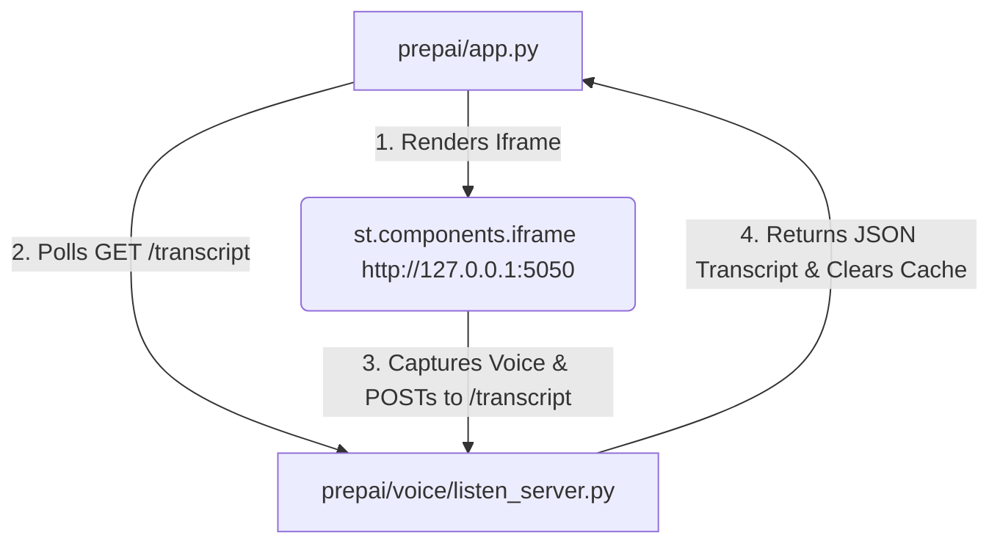

# 🎙️ PrepAI — Adaptive Interview Coach

PrepAI is an AI-powered conversational mock interview assistant built to deliver personalized, adaptive, and highly structured technical interview prep. Rather than generic canned questions, PrepAI analyzes the candidate's actual resume against a target job description to construct challenging, tailormade interview loops.

---

## 🚀 Key Features
1. **Resume & JD Profiler**: Dynamically parses uploaded resumes and target Job Descriptions, building a structured **Player Card** outlining candidate strengths, stand-out projects, and skill gaps.
2. **Context-Aware RAG**: Stores ingested resumes and job descriptions in **ChromaDB** collections. The agents query these vector databases at runtime to ground questions in real technical details and requirements.
3. **Multi-Agent Orchestration**: Powered by **LangGraph**, the app operates a stateful conversation loop switching between the **Profiler**, **Interviewer**, and **Evaluator** agents, pausing with stateful interrupts to receive candidate input.
4. **Conversational Speech (TTS)**: Reads out interviewer questions aloud using the Web Speech Synthesis API, featuring ranked voice selection and rate adjustments.
5. **Flask-Backed Voice Capture (STT)**: Bypasses browser iframe microphone sandbox restrictions by using a background Flask microservice serving a standalone voice recorder page.
6. **Live Analytics & 30-Day Plan**: Computes a running score across 6 core criteria (**Relevance**, **Specificity**, **STAR Completeness**, **Confidence**, **Accuracy**, and **Impact**). Generates a personalized 30-Day Action Plan upon interview completion.

---

## 📁 File Structure & Architectural Guide

```text
prepai/
├── app.py                      # Main Streamlit web interface & LangGraph orchestration loop
├── requirements.txt            # Python dependencies (Anthropic, ChromaDB, Flask, Requests)
├── agents/                     # LLM Agents (Claude Sonnet 4.5)
│   ├── profiler.py             # Agent 1: Reads resume, generates Player Card JSON
│   ├── interviewer.py          # Agent 2: Generates tailormade questions & follow-ups
│   └── evaluator.py            # Agent 3: Evaluates answers on a 6-dimension rubric
├── graph/                      # Stateful Multi-Agent System
│   └── orchestrator.py         # Defines LangGraph state machine & human-in-the-loop nodes
├── rag/                        # Retrieval Augmented Generation Layer
│   ├── ingest.py               # Processes text, splits chunks, embeds into ChromaDB
│   └── retriever.py            # Queries ChromaDB collections for candidate/job context
├── voice/                      # Conversational Voice Module
│   ├── __init__.py             # Empty init for package resolution
│   ├── speak.py                # Handles TTS (SpeechSynthesis Utterance) inside browser
│   ├── listen_server.py        # Local Flask app (port 5050) serving standalone mic page
│   ├── listen.py               # Renders capturer iframe & polls Flask server for transcripts
│   └── component/
│       └── index.html          # Standalone client voice recorder page
└── tests / debug scripts
    ├── test_voice.py           # TTS browser playback validation page (port 8503)
    ├── test_listen.py          # Text fallback input validation page
    ├── test_listen_v2.py       # Flask microservice and polling loop test page (port 8505)
    └── test_e2e_full.py        # Project root E2E pre-demo checklist test runner
```

---

## 🛠️ The Voice Layer Architecture (How it works)

Since browser security blocks microphone access inside sandboxed iframes generated by custom Streamlit components, PrepAI resolves this with a microservice bridge:



1. **Flask Server (`listen_server.py`)**: Runs in a background daemon thread on port `5050` when the Streamlit app starts.
2. **Recording Page (`index.html`)**: Served by Flask. Because it is loaded outside the Streamlit sandbox, the browser safely grants microphone access. It records speech using the HTML5 `webkitSpeechRecognition` API.
3. **Submission**: When the user stops speaking, the page `POST`s the transcript to Flask's `/transcript` endpoint.
4. **Polling (`listen.py`)**: Streamlit queries Flask's `GET /transcript` endpoint every `1` second. Once read, the server clears the stored transcript to avoid double-processing.

---

## ⚙️ Running and Testing

### Running the App
Start the app from the `prepai/` directory:
```bash
streamlit run app.py
```
*App URL: http://localhost:8501*

### Running Tests
All tests are located in the main subfolder or root. Here are the launch commands:

1. **E2E Demo Validation Checklist (Root)**:
   ```bash
   python3 test_e2e_full.py
   ```
2. **Text-To-Speech Playback Test**:
   ```bash
   streamlit run test_voice.py --server.port 8503
   ```
3. **Voice Recording Polling Test**:
   ```bash
   streamlit run test_listen_v2.py --server.port 8505
   ```
